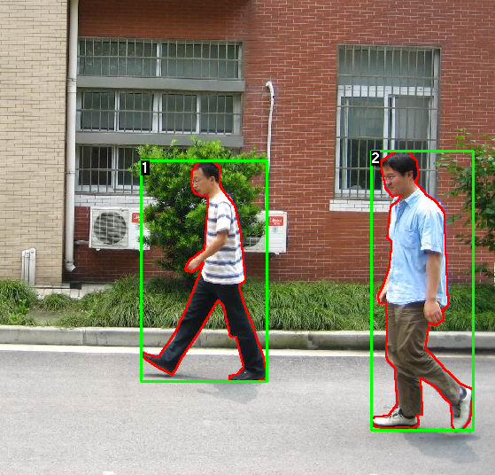

# Pedestrian Detection

## 1/- Introduction
In this project, we are interested in building a pedestrian detector. 
We train a [Faster r-cnn](https://arxiv.org/abs/1506.01497) network on the 
[Penn-Fudan Database for Pedestrian Detection](https://www.cis.upenn.edu/~jshi/ped_html/). 
The Penn-Fudan Database images are taken from scenes around campus and urban street.
The objects we are interested in these images are pedestrians. 
Each image will have at least one pedestrian in it.



## 2/- Requirements

* Python (3.6)
* PyTorch deep learning framework(1.2.0)
* Torchvision (0.4.0)
* The training was done on an GPU Nvidia GTX1050

## 3/- Usage

First, download the Penn-Fudan database from
 [here](https://www.cis.upenn.edu/~jshi/ped_html/), unzip it and place
  it on folder data. 
  
### Train 
  
  To train the model, navigate  (```cd```) to ```.\code\```and run 
  
  ```
  python train.py
  ```
   
   The weights will be saved to  ```.\model\```$
   
### Test
   
   The model can be tested by running 
   
   ```
   python test.py IMAGE_PATH
   ```
   
